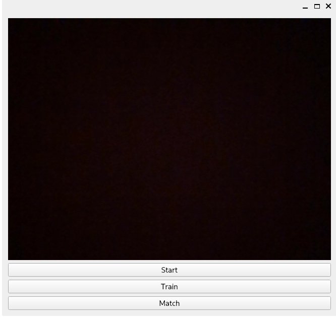
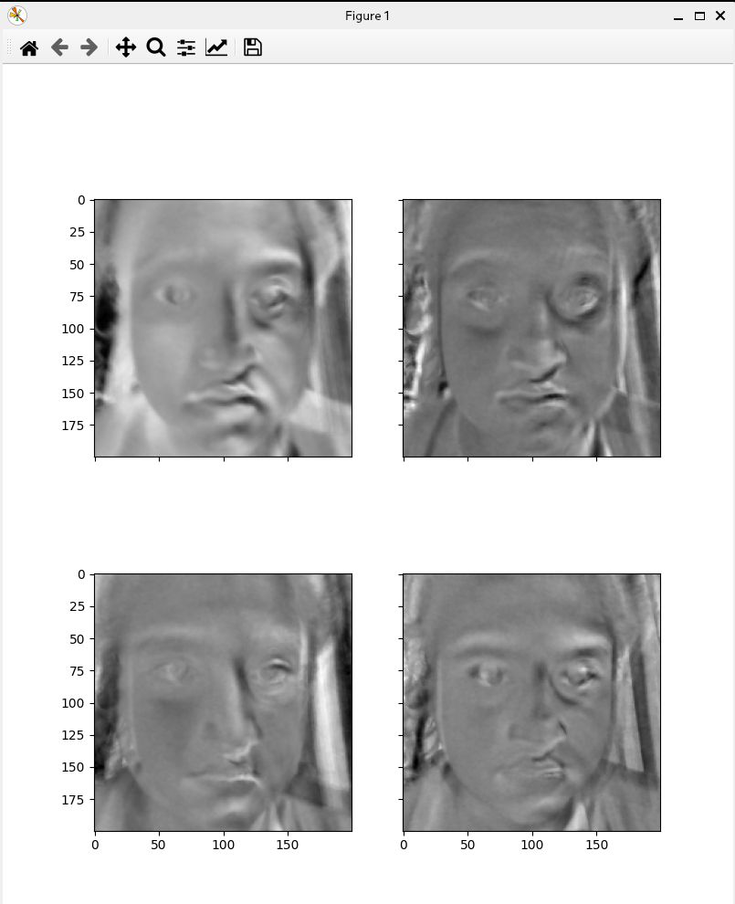
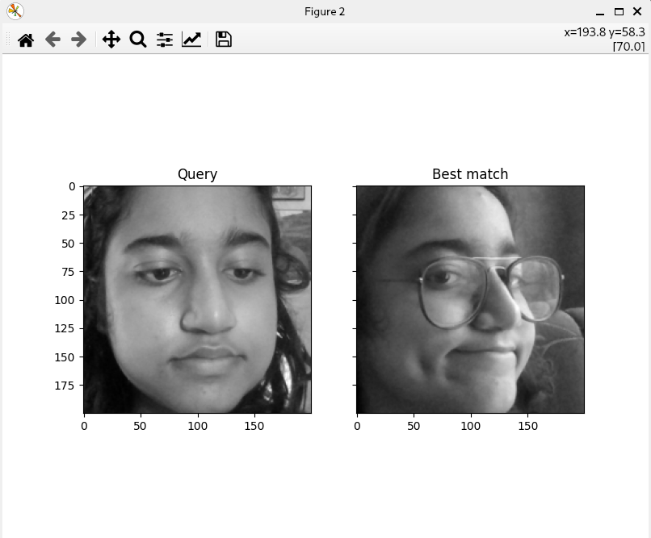
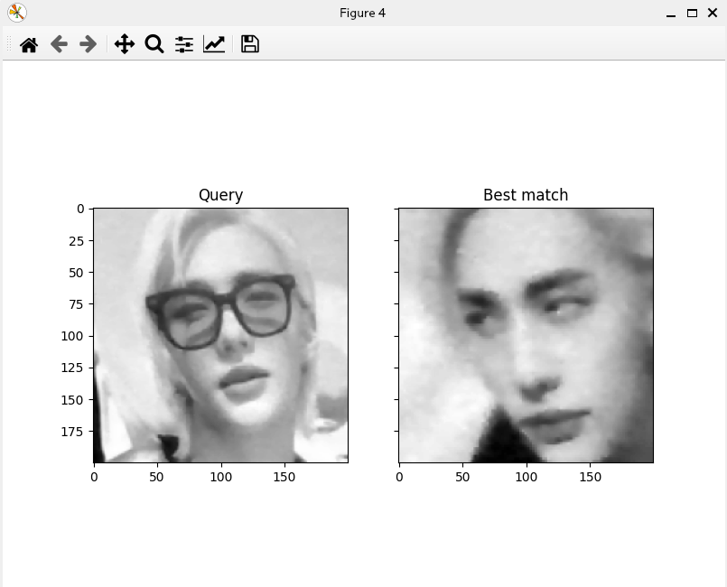

# Face Detection using OpenCV and Recognition using PCA

## Theory

1. A square matrix of pixels of 200x200 is used to detect the face, using
    the pre-trained haarcascade_frontalface_default.xml (provided by OpenCV).

2. The detected faces are stored in an array of matrices in memory.

3. When the user requests a match, the first 5 principal components of the
    stored faces are calculated, and the face with the least Euclidean distance
    from the current face is returned as the best match.

## Requirements

1. Download the opencv frontal face haarcascade xml (required for face detection):
```sh
curl https://raw.githubusercontent.com/opencv/opencv/master/data/haarcascades/haarcascade_frontalface_default.xml > haarcascade_frontalface_default.xml
```

2. Install all requisite python modules:
```sh
pip install -r requirements.txt
```

## Usage

```sh
./run.sh
```

- Click on 'Start' to begin the camera video feed.
- Click on 'Train' to capture the detected face for recognition (at least 5 captures required).
- Click on 'Match' to try and match the current detected face with the best match available.

## Screenshots






## Conclusion

1.  Initially, CPP and its OpenCV application was used to develop the face detection,
    but due to the need of using libraries like matplotlib and sklearn, a python
    implementation was done.

2.  Perceptual hash methods like block mean hash and annular variance hash, are prone to
    rotation, distortion, pincushion, tunelling attacks. Making it hard to match two faces
    at very different angles, so principal component analysis (of 5 principal components) was done.

    Since, PCA discards high frequency details and only compares low frequency pixels,
    only the structure of the face is compared with training models for face recognition.

3.  Storing the pixel matrices in a text file, would increase overhead, so all training
    is done in memory. Once the application closes, the training needs to be redone.
